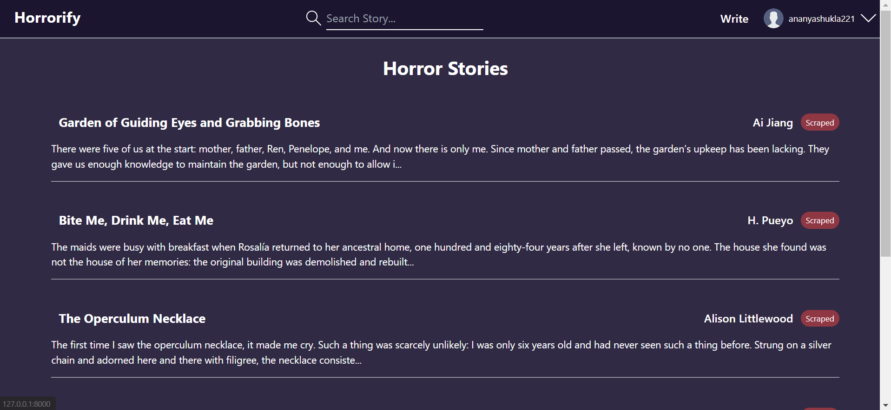
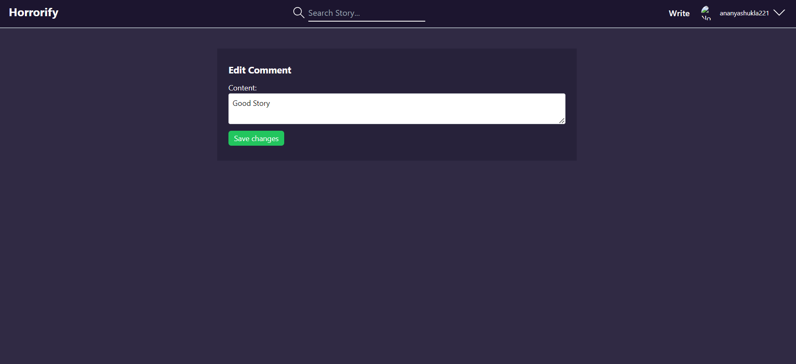
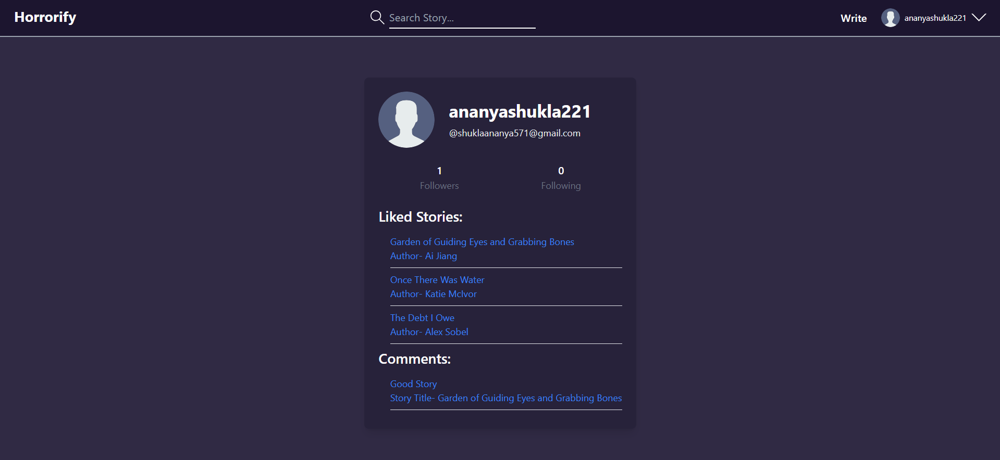
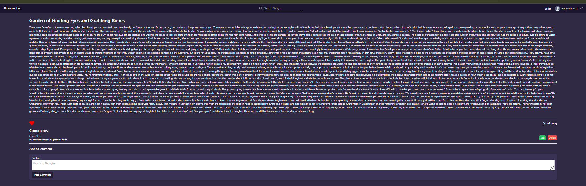

# Horrorify

## Features 
* It is A Full Stack Platform Where Users Can Create There Story,Update And Delete.
* I Have Implemented Searching And Filtering Options.
* Uou Can Follow and unfollow an Author.
* You Can Add,Delete And Update Your Comments.
* You Can Upload Your Image.
* You Can Like/Dislike Story.
* I Also Scraped Story And Save it into my Database. I Scraped Using Beautifoul soup.


## Examples







## Description
This is an Horror Story App where you can write Articles or Story of Ghost Or Paranormal. I Am a fan of this Genre And  Want to create something useful. 
All the Scraped Story you show are scraped from another Website. I Use BeautifulSoup for that task.

## Requirements
- Python 3.x
- Django 5.x (or your project's Django version)
- Any additional packages or dependencies

## Getting Started

### 1. Clone the Repository
Clone the repository using Git:

```bash
git clone [HorrorStory](https://github.com/ShadowAdi/HorrorStoryApp.git)
cd HorrorStryApp
```

## 2. Create a Virtual Environment
Create and activate a virtual environment to manage your project's dependencies:
```bash
python -m venv venv
venv\Scripts\activate
```


## 3. Install Dependencies
Install the required packages listed in requirements.txt:
```bash
pip install -r requirements.txt
```


## 4. Run Migrations
Apply database migrations to set up the initial database schema:
```bash
python manage.py migrate
```

## 5. Run the Development Server
Start the Django development server:
```bash
python manage.py runserver
```
